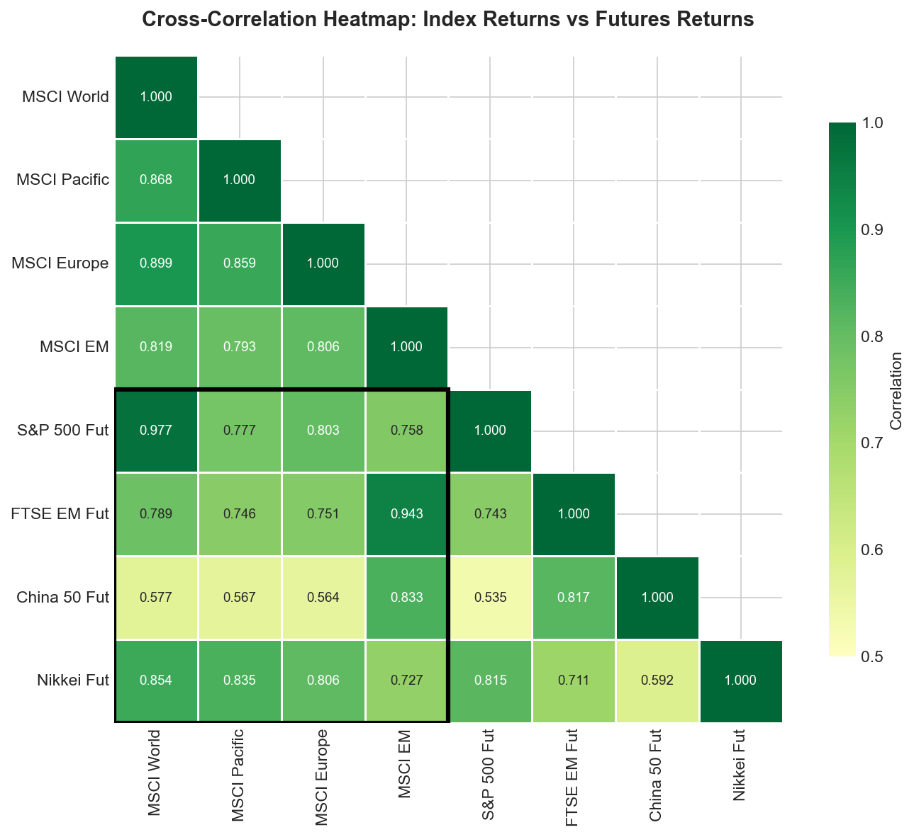
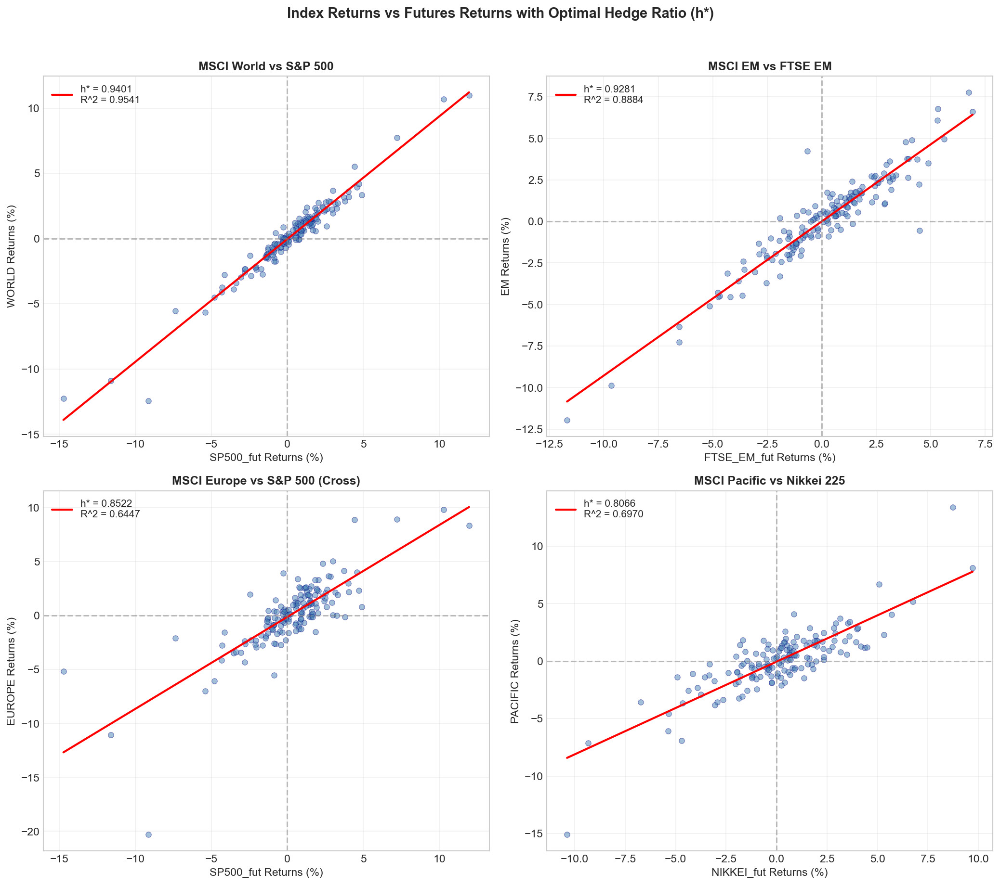
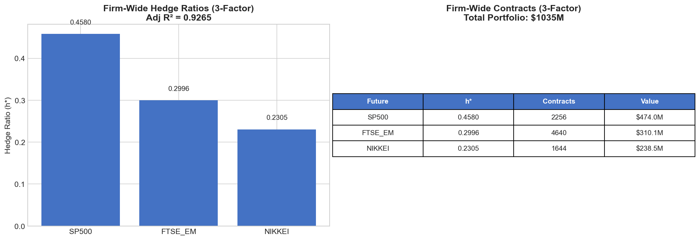
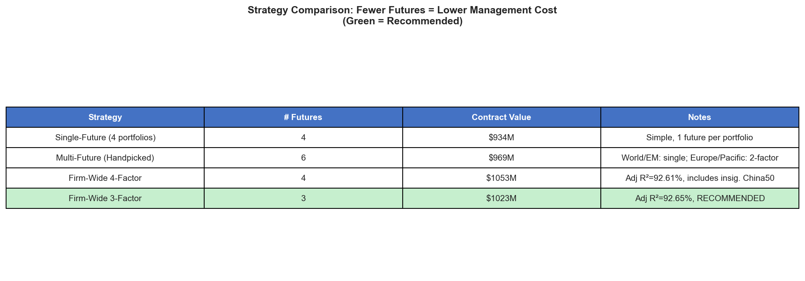

# Portfolio Hedging with Futures - Analysis Walkthrough

## BU623 Derivatives | Wilfrid Laurier University | TQM Hedge Fund Case Study

---

## Executive Summary

TQM Hedge Fund manages **$1.035 billion** across four regional equity portfolios. This analysis recommends the **Firm-Wide 3-Factor Hedge**:
- **Adj R² = 92.65%** (single regression, directly interpretable)
- **3 futures only** (lowest management cost)
- **Contracts**: 2,256 S&P 500 + 4,640 FTSE EM + 1,644 Nikkei (short)

---

## 1. Portfolio Overview

| Portfolio    | Index         | Value ($)         | Weight |
| ------------ | ------------- | ----------------- | ------ |
| MSCI World   | Global DM     | 500,000,000       | 48.3%  |
| MSCI EM      | Emerging Mkts | 200,000,000       | 19.3%  |
| MSCI Europe  | European DM   | 175,000,000       | 16.9%  |
| MSCI Pacific | Asia-Pacific  | 160,000,000       | 15.5%  |
| **Total**    |               | **1,035,000,000** | 100%   |

---

## 2. Correlation Analysis

The correlation heatmap shows the relationship between index returns and futures returns:



**Key Observations:**
- MSCI World ↔ S&P 500: **0.977** (very high - direct hedge)
- MSCI EM ↔ FTSE EM: **0.943** (very high - direct hedge)
- MSCI Europe ↔ S&P 500: **0.803** (moderate - cross-hedge)
- MSCI Pacific ↔ Nikkei: **0.835** (high - direct hedge)

The black box highlights the key cross-correlations between futures (rows) and indices (columns).

---

## 3. Contract Calculation Methodology

### Formula
The optimal number of futures contracts is:

```
N* = h* × (V_S / V_F)
```

Where:
- **N*** = Optimal number of contracts
- **h*** = Hedge ratio (beta from regression)
- **V_S** = Value of spot position (portfolio value)
- **V_F** = Value of one futures contract = Futures Price × Multiplier

### Contract Specifications

| Future   | Multiplier | Price      | Contract Value ($V_F$) |
| -------- | ---------- | ---------- | ---------------------- |
| S&P 500  | 50         | $4,202.50  | $210,125               |
| FTSE EM  | 100        | $668.30    | $66,830                |
| China 50 | 2          | $20,487.50 | $40,975                |
| Nikkei   | 5          | $29,020.00 | $145,100               |

---

## 4. Single-Future Hedging

### Scatter Plots with Regression Lines



### Regression Summary

| Portfolio    | Futures | h* (β) | R²     | t-stat | Contracts | Value ($M) |
| ------------ | ------- | ------ | ------ | ------ | --------- | ---------- |
| MSCI World   | S&P 500 | 0.9401 | 95.41% | 56.79  | 2,237     | 470        |
| MSCI EM      | FTSE EM | 0.9281 | 88.84% | 35.12  | 2,777     | 186        |
| MSCI Europe  | S&P 500 | 0.8522 | 64.47% | 16.77  | 710       | 149        |
| MSCI Pacific | Nikkei  | 0.8066 | 69.70% | 18.88  | 889       | 129        |
| **TOTAL**    |         |        |        |        | **6,613** | **$934M**  |

---

## 5. 4-Factor Regression (Feature Selection)


### 5.1 MSCI World - Model Summary

| Future  | β (h*)  | t-stat | p-value | Significant? |
| ------- | ------- | ------ | ------- | ------------ |
| SP500   | 0.7417  | 28.03  | <0.001  | ✓ Yes        |
| FTSE_EM | 0.1511  | 4.64   | <0.001  | ✓ Yes        |
| CHINA50 | -0.0417 | -1.68  | 0.094   | No           |
| NIKKEI  | 0.1517  | 5.74   | <0.001  | ✓ Yes        |

**Adj R² = 96.89%** | Significant: SP500, FTSE_EM, NIKKEI

### 5.2 MSCI EM - Model Summary

| Future  | β (h*) | t-stat | p-value | Significant? |
| ------- | ------ | ------ | ------- | ------------ |
| SP500   | 0.1360 | 3.16   | 0.002   | ✓ Yes        |
| FTSE_EM | 0.6265 | 11.84  | <0.001  | ✓ Yes        |
| CHINA50 | 0.2034 | 5.05   | <0.001  | ✓ Yes        |
| NIKKEI  | 0.0242 | 0.56   | 0.574   | No           |

**Adj R² = 90.96%** | Significant: SP500, FTSE_EM, CHINA50

### 5.3 MSCI Europe - Model Summary

| Future  | β (h*)  | t-stat | p-value | Significant? |
| ------- | ------- | ------ | ------- | ------------ |
| SP500   | 0.3000  | 3.53   | <0.001  | ✓ Yes        |
| FTSE_EM | 0.3931  | 3.76   | <0.001  | ✓ Yes        |
| CHINA50 | -0.1068 | -1.34  | 0.181   | No           |
| NIKKEI  | 0.4408  | 5.19   | <0.001  | ✓ Yes        |

**Adj R² = 73.68%** | Significant: SP500, FTSE_EM, NIKKEI

### 5.4 MSCI Pacific - Model Summary

| Future  | β (h*)  | t-stat | p-value | Significant? |
| ------- | ------- | ------ | ------- | ------------ |
| SP500   | 0.1194  | 1.69   | 0.093   | No           |
| FTSE_EM | 0.3471  | 3.99   | <0.001  | ✓ Yes        |
| CHINA50 | -0.1070 | -1.62  | 0.108   | No           |
| NIKKEI  | 0.5239  | 7.42   | <0.001  | ✓ Yes        |

**Adj R² = 74.91%** | Significant: FTSE_EM, NIKKEI

---

## 6. Multi-Future Decision Analysis

Based on the 4-factor results, we evaluate whether adding futures improves R² enough to justify added complexity and contracts.

### 6.1 MSCI World Decision

| Model      | Adj R² | Futures              | h* Values      | Contracts       | Value |
| ---------- | ------ | -------------------- | -------------- | --------------- | ----- |
| **Single** | 95.41% | SP500                | 0.9401         | 2,237           | $470M |
| 3-Factor   | 96.89% | SP500+FTSE_EM+NIKKEI | 0.74/0.15/0.15 | 1,765+1,130+523 | $740M |

**Decision: Use Single Hedge (S&P 500)**
- +1.48pp R² improvement not worth +$270M contract value
- ✓ Simpler, lower margin

### 6.2 MSCI EM Decision

| Model      | Adj R² | Futures               | h* Values      | Contracts     | Value |
| ---------- | ------ | --------------------- | -------------- | ------------- | ----- |
| **Single** | 88.84% | FTSE_EM               | 0.9281         | 2,777         | $186M |
| 3-Factor   | 90.96% | SP500+FTSE_EM+CHINA50 | 0.14/0.63/0.20 | 133+1,876+993 | $109M |

**Decision: Use Single Hedge (FTSE EM)**
- +2.12pp R² improvement
- 3-factor actually reduces contract value but adds complexity
- ✓ Adequate R² with simpler execution

### 6.3 MSCI Europe Decision

| Model        | Adj R² | Futures              | h* Values      | Contracts     | Value |
| ------------ | ------ | -------------------- | -------------- | ------------- | ----- |
| Single       | 64.47% | SP500                | 0.8522         | 710           | $149M |
| **2-Factor** | ~72%   | SP500+NIKKEI         | 0.46/0.51      | 384+617       | $170M |
| 3-Factor     | 73.68% | SP500+FTSE_EM+NIKKEI | 0.30/0.39/0.44 | 250+1,029+531 | $181M |

**Decision: Use 2-Factor (S&P 500 + Nikkei)**
- Single hedge has high basis risk (64.47% R²)
- 2-factor improves to ~72% with manageable contract increase
- 3-factor adds FTSE_EM for only ~1.5pp more - diminishing returns

### 6.4 MSCI Pacific Decision

| Model        | Adj R² | Futures        | h* Values | Contracts | Value |
| ------------ | ------ | -------------- | --------- | --------- | ----- |
| Single       | 69.70% | NIKKEI         | 0.8066    | 889       | $129M |
| **2-Factor** | 74.91% | FTSE_EM+NIKKEI | 0.30/0.60 | 715+657   | $143M |

**Decision: Use 2-Factor (FTSE_EM + Nikkei)**
- +5.2pp R² improvement is meaningful
- Contract value increase modest ($14M)
- Captures both EM and Japan exposure

### 6.5 Multi-Future Summary

| Portfolio    | Model    | Futures          | Contracts | Value     |
| ------------ | -------- | ---------------- | --------- | --------- |
| MSCI World   | Single   | SP500            | 2,237     | $470M     |
| MSCI EM      | Single   | FTSE_EM          | 2,777     | $186M     |
| MSCI Europe  | 2-Factor | SP500 + NIKKEI   | 384 + 617 | $170M     |
| MSCI Pacific | 2-Factor | FTSE_EM + NIKKEI | 715 + 657 | $143M     |
| **TOTAL**    |          | **6 futures**    | **7,387** | **$969M** |

---

## 7. Firm-Wide Portfolio Hedge

### 7.1 Why Firm-Wide?

Instead of hedging each portfolio separately (6 futures), we hedge the entire $1.035B as one unit:
- **Diversification benefit**: Portfolio correlations reduce overall risk
- **Fewer futures (3)**: Lower management cost
- **Single R² metric**: Directly interpretable

### 7.2 3-Factor Model (Excludes Insignificant China50)



| Future    | β (h*) | t-stat | Contracts | Value       |
| --------- | ------ | ------ | --------- | ----------- |
| SP500     | 0.4580 | ***    | 2,256     | $474M       |
| FTSE_EM   | 0.2996 | ***    | 4,640     | $310M       |
| NIKKEI    | 0.2305 | ***    | 1,644     | $239M       |
| **TOTAL** |        |        | **8,540** | **$1,023M** |

**Adj R² = 92.65%**

### Contract Calculation

```
N*(SP500)   = 0.4580 × (1,035,000,000 / 210,125) = 2,256 contracts
N*(FTSE_EM) = 0.2996 × (1,035,000,000 / 66,830)  = 4,640 contracts
N*(NIKKEI)  = 0.2305 × (1,035,000,000 / 145,100) = 1,644 contracts
```

---

## 8. Strategy Comparison



| Strategy         | # Futures | Contracts | Value       | Notes             |
| ---------------- | --------- | --------- | ----------- | ----------------- |
| Single-Future    | 4         | 6,613     | $934M       | 1 per portfolio   |
| Multi-Future     | 6         | 7,387     | $969M       | Handpicked        |
| Firm-Wide 4F     | 4         | ~10,377   | $1,053M     | Includes China50  |
| **Firm-Wide 3F** | **3**     | **8,540** | **$1,023M** | **Adj R²=92.65%** |

> **Key Insight**: Firm-Wide 3-Factor achieves the highest Adj R² (92.65%) with fewest futures (3).

---

## 9. Conclusion & Recommendation

### Recommended: **Firm-Wide 3-Factor Hedge**

| Metric             | Value      |
| ------------------ | ---------- |
| **Adj R²**         | **92.65%** |
| **# Futures**      | **3**      |
| **Contracts**      | 8,540      |
| **Contract Value** | $1,023M    |

### Final Position (Short)

| Future    | h*     | Contracts | Value       |
| --------- | ------ | --------- | ----------- |
| S&P 500   | 0.4580 | 2,256     | $474M       |
| FTSE EM   | 0.2996 | 4,640     | $310M       |
| Nikkei    | 0.2305 | 1,644     | $239M       |
| **TOTAL** |        | **8,540** | **$1,023M** |

### Why Firm-Wide 3-Factor is Optimal:

1. **Highest Adj R² (92.65%)** - Best hedge effectiveness
2. **Fewest Futures (3)** - Minimal management complexity
3. **Lower Margin** - Fewer positions = less capital
4. **Diversification** - Benefits from portfolio correlations
5. **No Irrational Positions** - Excludes insignificant China50

---

## Appendix: Files Generated

| File                         | Description                      |
| ---------------------------- | -------------------------------- |
| `01_correlation_heatmap.png` | Index-futures correlation matrix |
| `02_scatter_plots.png`       | Single-future regression plots   |
| `05_four_factor_table.png`   | 4-factor regression results      |
| `07_firmwide_summary.png`    | Firm-wide hedge summary          |
| `09_strategy_comparison.png` | Strategy comparison chart        |
| `all_contracts.csv`          | All contract calculations        |

---

## How to Reproduce

```powershell
python hedging_analysis.py
```
